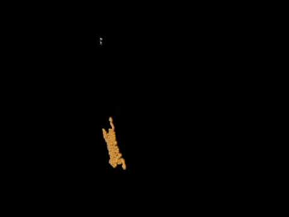
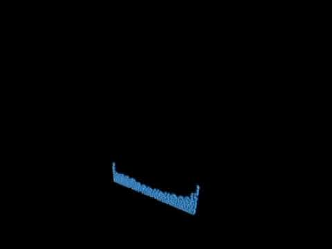
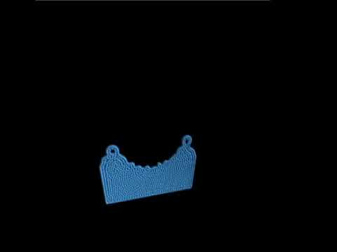
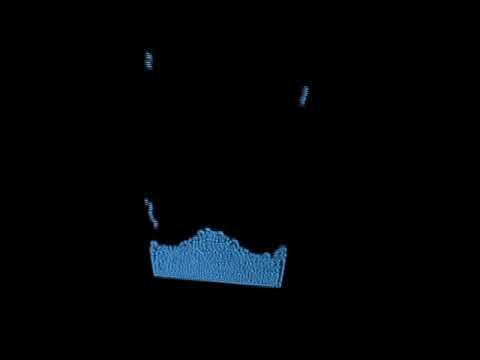

# CS 184 Spring 2018 | Final Project

**Yiyun Wang, &nbsp; Xiaoyu Dai, &nbsp; Zekai Fan**
  ___
## Abstract

We built a 2D simulation of water using the position-based fluid model as modified from Position Based Fluids (Macklin 2013). Our simulation is capable of handling small to medium number of particles (thousands) at or near real time. Physical properties, including incompressibility, vorticity and viscosity of water and its movement are enforced to render realistically. Various improvements have been implemented to make the rendering aesthetically appealing. CPU-level parallelism is considered to accelerate the simulation and to allow more particles to be handled in real time.

## Technical approach

We followed the Macklin paper as a point of entry. Following the scheme in the paper, we implemented a position-based system of particles in a 3D grid, each bearing a position vector and a velocity vector, from the Sun skeleton code. In addition, numerous other attributes to a particle are included in our particle struct, including external forces on the particle, neighbors of the particle and the vorticity at its position.

Recording these information enables us to track each particle precisely. We are able to reconstruct the current state of the grid and thence the future state one step from the current one, by traversing each and every particle presented in the grid. The 3D grid is later modified to become 2D, with every particle's third coordinate set to zero. This modification preserves much of other parts of the implementation without the need to change. This implementation is capable of switching between 2D and 3D grids by simply disabling or enabling the third coordinate.

The algorithm involves many passes of the traversal of all particles. To make this process convenient, each particle is pushed into a vector of particles when it is created. The first pass calculates the total external forces exerting on each particle and stores the value as one of the particle's attributes. The algorithm then updates all particle's velocity as a result of applying the external forces. A position one time step away in the future is calculated and stored, which will then be used to find the particle's neighbors in the second pass. Every particle's position is hashed into a double precision float number so as to store in a map that expedites the finding of neighbors by directly linking a position in the grid to a particle. Since water is incompressible under our assumption for this simulation, no two particles can occupy the same position at any given time step. This map is therefore injective.

In the next pass, the scaling factor lambda is calculated for each particle from its position and the positions of its neighbors. This factor is then used to enforce incompressibility of water, that is, to ensure that constant density everywhere in the grid does not change from one time step to the next. In the next pass, a vector is calculated from that of the neighboring particles using Newton steps of gradient of the constraint function to correct for each particle's change in position to the next time step. Kernel functions are used in the calculations. Collision is then enforced by bouncing every to-be out-of-boundary particle to its closest point on the boundary. In the next pass, predicted position of each particle is updated with the correction vector applied. This enforcing incompressibility, correction and collision response, and updating position prediction cycle is then repeated an arbitrary number of times to allow the predicted position for every particle to converge. Finally, vorticity at each particle's position is calculated using a estimator function. The vorticity-induced force is then applied to every particle. Viscosity is then considered and added to update each particle's velocity, so as not to reduce incoherent motion.

The versatility of OpenGL is exploited to add a hint of artistic will to the rendering of the otherwise plain and boring blue dots. Various library functions are called to paint the particles with vivid colors according to either the change in distance, or the position of the mouse. In main class, the function of tracking mouse position is called every loop to make sure particle¡¯s color matches with the position of the mouse. This provides an interactive way for audience to experience the water simulation, and to understand this project thoroughly with the cool visual effect.

Parallelizable portion of the code is intended to parallelize at thread level using OpenMP. So long as a pass of particle traversal does not involve any updating in which a particle visited later in the sequence depends on the outcome of a earlier one, the pass is deemed as parallelizable. These passes include finding neighbors, calculating scaling factor lambdas, calculating correction vectors, updating predicted positions, calculating vorticities and viscosities, and the final updating of particle positions. This could potentially increase the number of particles to simulate smoothly in many folds given the current hardware.

 

----

**Challenges we have encountered during our implementation and testing include:**

1\. Finding the scale of the number of particles appropriate to our machines¡¯ capability. We tried to solve this problem by testing different numbers of particles as well as different shapes of them (that is, how many particles there are in each dimension). We are able to come up with a setting that our machines can handle near real time. We learned to experiment with scale and to monitor hardware performance in the meantime.

2\. Figure out how to correctly install glfw, openGl, and glew inside Windows system. At first we use both Windows and Mac for coding, but then we realized that the MakeFile for Mac was not able to run on Windows system. I first had a difficult time coding without any help from IDE, but eventually successfully install necessary libraries using cygwin and managed to run the code with Visual Studio on Windows system.

## Results

**Render result with color change by position of mouse**

**Render result with color change by height of particles**

**Render result with tensile simulation**

**Render result with normal simulation**

</td>

</tr>

</tbody>

</table>

## References

Macklin, Miles and Matthias Mueller. Position Based Fluids. 2013. Sun, Weilun. ¡°[A] simple skeleton for visualizing 3d particle sims with openGL¡±. Some time ago.

## Contributions from each team member

**Yiyun Wang:**

1\. Implemented simulation loop (update particle position part)
2\. Recorded milestone video
3\. Structured milestone website page
4\. Add additional code to achieve various color features
5\. Made final video
6\. Made final ppt associated with the video
7\. Structured final website page
8\. Contributed to the report
9\. Recorded final results of the code

**Zekai Fan:**

1\. Implemented simulation loop (update vorticity confinement and viscosity part)
2\. Drafted this report.
3\. Contributed to milestone ppt.

**Xiaoyu Dai:**

1\. Implemented simulation loop (update external forces and collision part)
2\. Implemented main structure of the code based on starter code
3\. Debugged all of the code, add improvement to the algorithm
4\. Set suitable values for all parameters
5\. Contributed to milestone ppt
6\. Help solved System incompatibility issue
